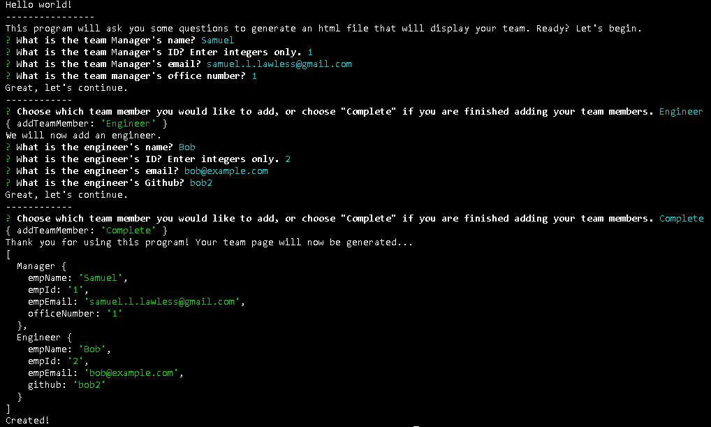
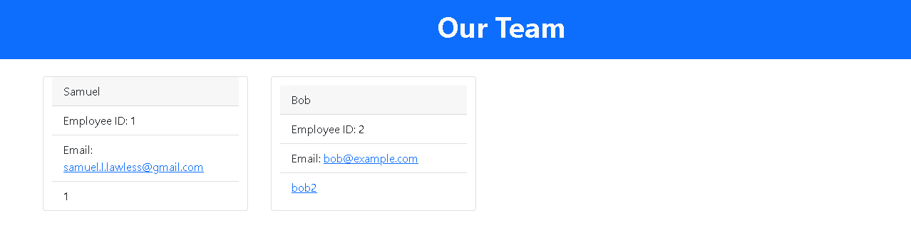

# Team-builder

## Description
Team managers can use this to quickly view their team's information including email and GitHub profiles

## Table of Contents
1.[Installation](#installation)
2.[Usage](#usage)
3.[Contributing](#contributing)
4.[Questions](#questions)

## Installation
Once cloned to your local machine, run 'npm install' in the terminal. Packages used includes inquirer and jest. Inquirer allows for easy to use questions for the user to answer, and jest is a testing package. Run 'npm test' to ensure the application has been cloned and installed properly. 

## Usage
After installation, run 'npm start' in the terminal. The application will prompted you with a series of questions. After answering the prompts, an html file will be generated in the same folder as the application. See the video for an example: https://youtu.be/1oaqUqim-ts

## Contributing
If you are interested in contributing to this project, please see my github profile to contact me or to reference my email. 

#Questions
Any questions you have about this project, please see my github profile to reference how to conact me. 
